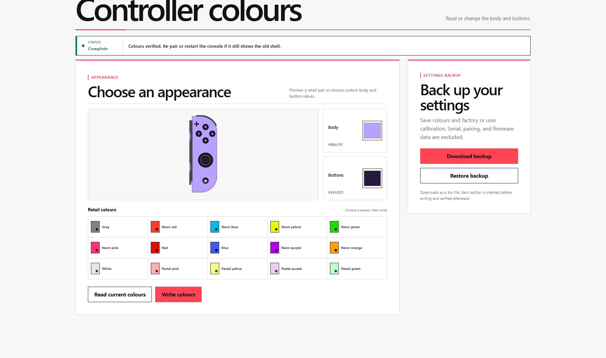
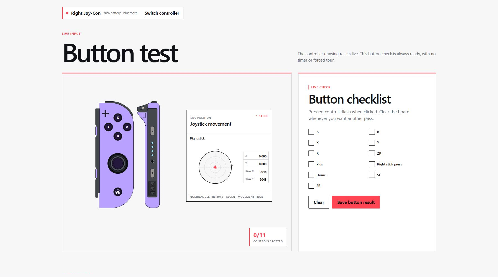
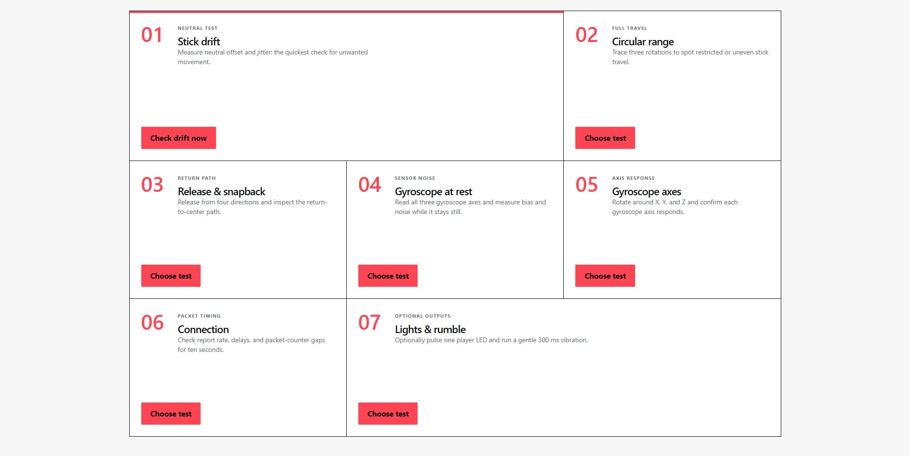

# JoyConBench

Browser-based diagnostics and colour settings tools for original Nintendo Switch Joy-Con.

**Live Site:** [reubenjds.github.io/joyconbench](https://reubenjds.github.io/joyconbench/)





## Features

- Live buttons, joystick movement, and controller rendering
- Selectable stick, motion, connection, LED, and rumble tests
- Printable, plain-text, and privacy-safe JSON reports
- Retail colour presets and body/button colour editing
- Compact and quick settings backup and restore
- Live 80×60 grayscale IR camera viewer and guided sensor-response check for right Joy-Con

## Prerequisites

- Node.js 24 and pnpm to run locally
- Desktop Chrome, Edge, or another Chromium browser with WebHID
- Original left or right Joy-Con over Bluetooth

The IR camera tool requires an original right Joy-Con. Left Joy-Con controllers do not contain the
infrared camera hardware.

> Note: Safari, Firefox, iOS, third-party controllers, and Switch 2 controllers are not supported.

## Run locally

```sh
pnpm install
pnpm dev
```

## Safety and privacy

Controller samples stay in memory and are not uploaded. Reports exclude MAC addresses, serial
numbers, raw packets, sample streams, and calibration values. See [PRIVACY.md](./PRIVACY.md).

IR images are rendered directly from volatile browser memory. They are discarded when streaming
stops and are never added to reports, backups, or downloads.

Settings tools are limited to documented colour and calibration regions. Backups include a checksum
and controller type; erase and firmware commands are blocked.

Diagnostic limits are documented in [THRESHOLDS.md](./THRESHOLDS.md). Results describe observed
patterns, not confirmed hardware faults.

## Credits

- [Nintendo Switch Reverse Engineering](https://github.com/dekuNukem/Nintendo_Switch_Reverse_Engineering): protocol, calibration, motion, and rumble research
- [Joy-Con WebHID](https://github.com/tomayac/joy-con-webhid): WebHID implementation reference
- [Joy-Con Toolkit](https://github.com/CTCaer/jc_toolkit): inspiration for testing and controller settings tools
- [Nintendo Switch Brew: Joy-Con](https://switchbrew.org/wiki/Joy-Con): controller and retail colour documentation
- [WebHID specification](https://wicg.github.io/webhid/): browser API reference

Controller artwork is adapted from
[Nintendo Switch Joy-Con illustration.svg](https://commons.wikimedia.org/wiki/File:Nintendo_Switch_Joy-Con_illustration.svg)
by 0 Noctis 0 under CC BY-SA 4.0. See [NOTICE.md](./NOTICE.md).

## Disclaimer

JoyConBench is not affiliated with, endorsed by, or sponsored by Nintendo.

## License

[MIT](./LICENSE)
